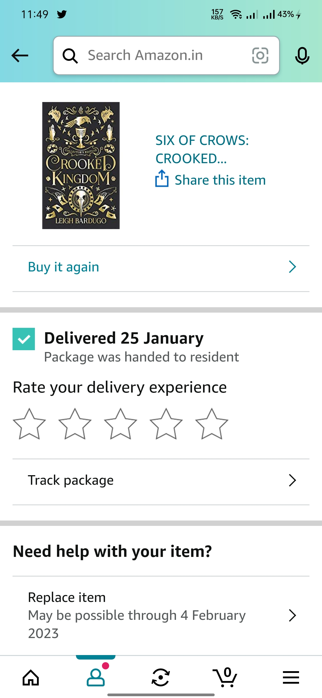

# bookit.services
# [Website Here](https://globalbloodbanking.ml/ware/login) | [App Here](https://drive.google.com/file/d/11wZ_09a3Q_Dx0UdZoB4NDb7GwuoueZkc/view?usp=share_link) | [Documentation Here](https://drive.google.com/file/d/11wZ_09a3Q_Dx0UdZoB4NDb7GwuoueZkc/view?usp=share_link)
bookit.services is a hyperlocal one-stop solution to the on demand service needs of modern day families, buisnesses and homes.

### Feature of bookit.services
- allows you to manage your inventory, sales, purchases, customers, invoices, take payments and much more.
- Update your stock information, make purchases and view sales information from anywhere anytime. 
- For products,you have Standard Product, Digital Product, Product Category with operation functionalites of Add, edit, delete & view products, Print Barcodes, Import by CSV
- Transfer products to warehouses, price estimation for freights using ML model
- Overview & warehouse stock charts, Product quantity & expiry alerts, Daily, monthly custom sales, payments, profit/loss purchase report, Customers, supplier, due, best-seller reports

###UI/UX
<pre>
   
</pre>
### How to run?
- setup server through cpanel
- flask run to expose API
- follow the attached documentation
- Login: admin Password: admin

### Contributors
- Shashank Kumar
- Aman Gupta
- Shubhi Singh

Built with ❤️ by Team C.O.D.E 
Paradigm, E-Submit'23 
Shiv Nadar University
